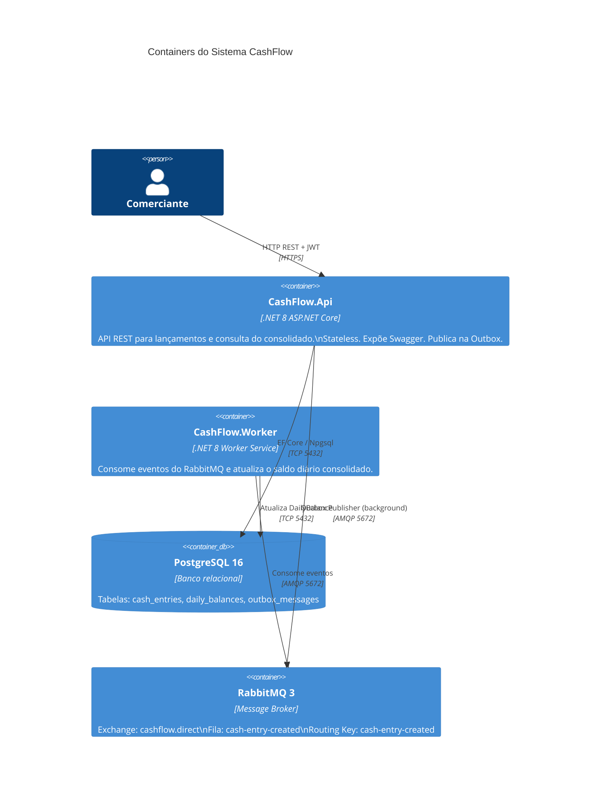
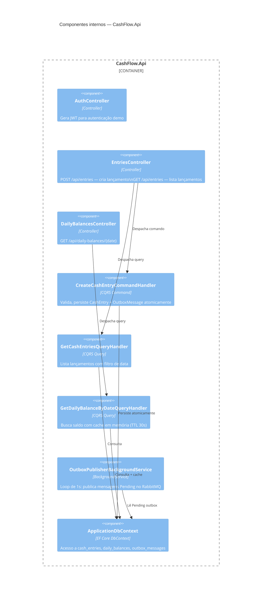
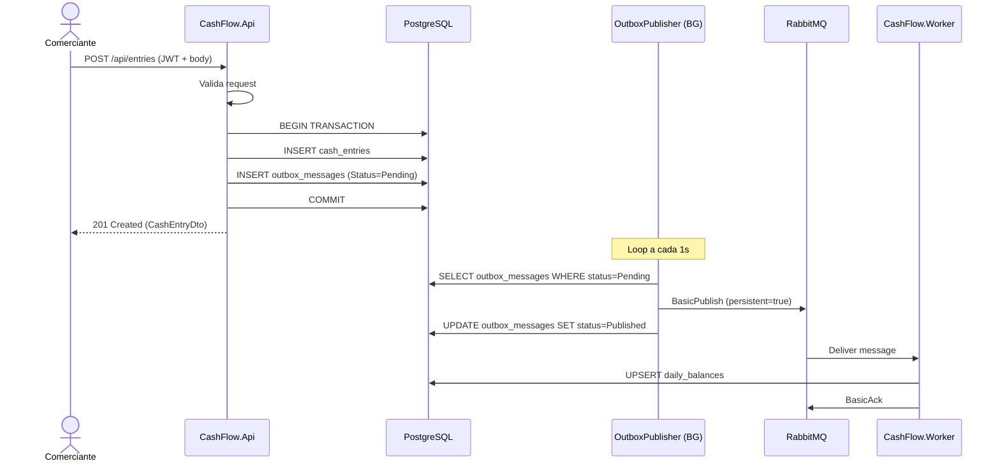
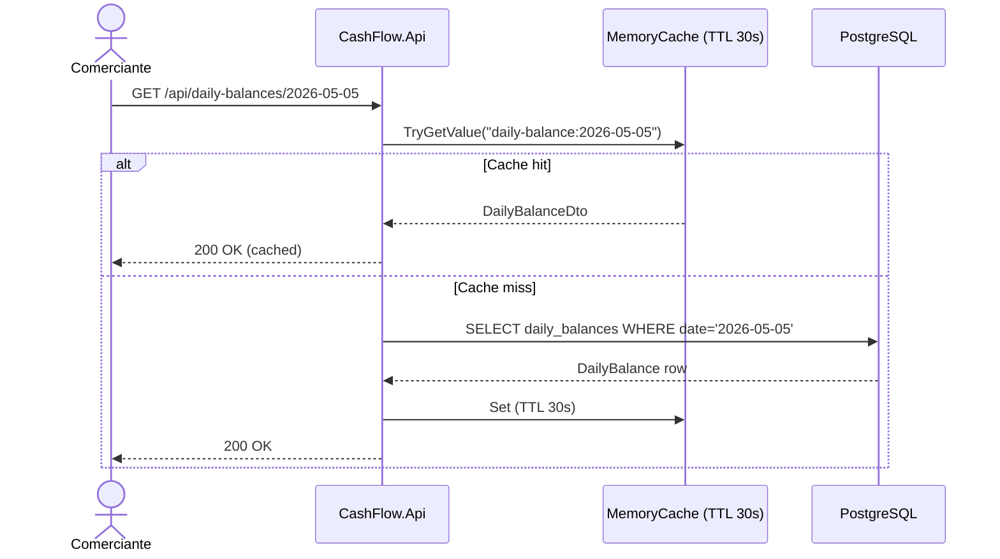

# CashFlow Challenge — Controle de Fluxo de Caixa

Solução para o desafio de Arquiteto de Software que implementa um sistema de controle de fluxo de caixa com **Clean Architecture**, **CQRS**, **Outbox Pattern**, **RabbitMQ** e **Docker Compose** em **.NET 8 / C#**.

---

## Sumário

- [Visão Geral da Solução](#visão-geral-da-solução)
- [Arquitetura](#arquitetura)
  - [Diagrama de Contexto (C4 — Nível 1)](#diagrama-de-contexto-c4--nível-1)
  - [Diagrama de Containers (C4 — Nível 2)](#diagrama-de-containers-c4--nível-2)
  - [Diagrama de Componentes (C4 — Nível 3)](#diagrama-de-componentes-c4--nível-3)
  - [Fluxo de Lançamento](#fluxo-de-lançamento)
  - [Fluxo de Consolidação](#fluxo-de-consolidação)
- [Estrutura do Projeto](#estrutura-do-projeto)
- [Decisões Arquiteturais](#decisões-arquiteturais)
- [Requisitos Não Funcionais](#requisitos-não-funcionais)
- [Tecnologias Utilizadas](#tecnologias-utilizadas)
- [Como Rodar Localmente](#como-rodar-localmente)
  - [Pré-requisitos](#pré-requisitos)
  - [Com Docker Compose (recomendado)](#com-docker-compose-recomendado)
  - [Sem Docker (desenvolvimento)](#sem-docker-desenvolvimento)
- [Passo a Passo: Testando a Solução](#passo-a-passo-testando-a-solução)
  - [Passo 1 — Subir o ambiente](#passo-1--subir-o-ambiente)
  - [Passo 2 — Obter token JWT](#passo-2--obter-token-jwt)
  - [Passo 3 — Registrar lançamentos](#passo-3--registrar-lançamentos)
  - [Passo 4 — Consultar o consolidado diário](#passo-4--consultar-o-consolidado-diário)
  - [Passo 5 — Monitorar a fila e o Outbox](#passo-5--monitorar-a-fila-e-o-outbox)
  - [Passo 6 — Testar resiliência (Worker fora do ar)](#passo-6--testar-resiliência-worker-fora-do-ar)
  - [Passo 7 — Rodar os testes unitários](#passo-7--rodar-os-testes-unitários)
  - [Usando o Swagger UI](#usando-o-swagger-ui)
- [Endpoints da API](#endpoints-da-api)
- [Autenticação](#autenticação)
- [Testes](#testes)
- [Monitoramento e Observabilidade](#monitoramento-e-observabilidade)
- [Evoluções Futuras](#evoluções-futuras)

---

## Visão Geral da Solução

Um comerciante precisa:
1. **Registrar lançamentos** (débitos e créditos) no fluxo de caixa diário.
2. **Consultar o saldo diário consolidado** por data.

**Requisito crítico:** O serviço de lançamentos **não deve ficar indisponível** se o serviço de consolidação cair.
**Carga de pico:** O consolidado recebe até **50 req/s**, com no máximo **5% de perda**.

### Estratégia adotada

Foi escolhida uma arquitetura de **monólito modular com Worker separado** em vez de dois microsserviços independentes, pois:

- Entrega o desacoplamento exigido (via RabbitMQ + Outbox Pattern).
- Reduz complexidade operacional (sem service discovery, sem API Gateway).
- Permite evolução natural para microsserviços conforme o crescimento do produto.
- Mantém fronteiras claras entre os dois domínios (lançamentos e consolidação).

---

## Arquitetura

### Diagrama de Contexto (C4 — Nível 1)

```mermaid
C4Context
    title Sistema de Controle de Fluxo de Caixa

    Person(merchant, "Comerciante", "Usuário que registra lançamentos e consulta o saldo diário")
    System(cashflow, "CashFlow System", "Registra lançamentos de débito e crédito e consolida o saldo diário por data")
    SystemExt(rabbitmq, "RabbitMQ", "Broker de mensagens para desacoplamento entre escrita e consolidação")
    SystemExt(postgres, "PostgreSQL", "Banco de dados relacional para persistência dos dados")

    Rel(merchant, cashflow, "Registra lançamentos / Consulta saldo", "HTTPS/REST")
    Rel(cashflow, rabbitmq, "Publica eventos de lançamento")
    Rel(cashflow, postgres, "Lê e persiste dados")
```

### Diagrama de Containers (C4 — Nível 2)



### Diagrama de Componentes (C4 — Nível 3)



### Fluxo de Lançamento



### Fluxo de Consolidação (Consulta)



---

## Estrutura do Projeto

```
CashFlow-Challenge/
├── src/
│   ├── CashFlow.Domain/                    # Entidades, Enums, Eventos de domínio
│   │   ├── Common/Entity.cs
│   │   ├── Entities/
│   │   │   ├── CashEntry.cs                # Aggregate root: lançamento
│   │   │   ├── DailyBalance.cs             # Projeção: saldo diário
│   │   │   └── OutboxMessage.cs            # Outbox pattern
│   │   ├── Enums/EntryType.cs              # Credit | Debit
│   │   └── Events/CashEntryCreatedEvent.cs
│   │
│   ├── CashFlow.Application/               # Casos de uso (CQRS)
│   │   ├── Abstractions/
│   │   │   ├── Data/IApplicationDbContext.cs
│   │   │   └── Messaging/ ICommand, ICommandHandler, IQuery, IQueryHandler
│   │   ├── Features/
│   │   │   ├── CashEntries/Commands/CreateCashEntry/
│   │   │   ├── CashEntries/Queries/GetCashEntries/
│   │   │   ├── DailyBalances/Queries/GetDailyBalanceByDate/
│   │   │   └── Outbox/Queries/GetOutboxMessages/
│   │   └── DependencyInjection.cs
│   │
│   ├── CashFlow.Infrastructure/            # Implementações externas
│   │   ├── Persistence/ApplicationDbContext.cs
│   │   ├── Messaging/
│   │   │   ├── OutboxPublisherBackgroundService.cs  # Produtor RabbitMQ
│   │   │   ├── CashEntryCreatedConsumerHostedService.cs # Consumidor
│   │   │   ├── RabbitMqConnectionFactory.cs
│   │   │   └── RabbitMqTopologyInitializer.cs
│   │   └── DependencyInjection.cs
│   │
│   ├── CashFlow.Api/                       # Ponto de entrada da API REST
│   │   ├── Controllers/
│   │   │   ├── AuthController.cs           # POST /api/auth/token
│   │   │   ├── EntriesController.cs        # POST/GET /api/entries
│   │   │   ├── DailyBalancesController.cs  # GET /api/daily-balances/{date}
│   │   │   └── OutboxController.cs         # GET /api/outbox (diagnóstico)
│   │   ├── Contracts/                      # DTOs de request
│   │   ├── Program.cs                      # Bootstrapping
│   │   └── Dockerfile
│   │
│   └── CashFlow.Worker/                    # Worker de consolidação
│       ├── Program.cs
│       └── Dockerfile
│
├── tests/
│   └── CashFlow.UnitTests/
│       ├── Domain/CashEntryTests.cs
│       ├── Domain/DailyBalanceTests.cs
│       ├── Domain/OutboxMessageTests.cs
│       └── Application/CreateCashEntryHandlerTests.cs
│
├── docs/
│   ├── architecture.md                     # Decisões de arquitetura
│   ├── non-functional-requirements.md      # SLAs e métricas
│   └── adr/
│       ├── 0001-use-rabbitmq.md
│       ├── 0002-use-postgresql-in-compose.md
│       ├── 0003-outbox-plus-rabbitmq.md
│       ├── 0004-clean-architecture.md
│       ├── 0005-cqrs-pattern.md
│       └── 0006-jwt-auth.md
│
├── docker-compose.yml
├── CashFlowChallenge.sln
└── README.md
```

---

## Decisões Arquiteturais

| Decisão | Escolha | Motivação |
|---|---|---|
| Estilo arquitetural | Monólito modular + Worker | Menor complexidade operacional; evolui para microsserviços naturalmente |
| Padrão de camadas | Clean Architecture | Inversão de dependências; testabilidade; separação de responsabilidades |
| Padrão de acesso a dados | CQRS (sem event sourcing) | Segregação de comandos e consultas; otimização por caminho de leitura |
| Desacoplamento entre serviços | Outbox Pattern + RabbitMQ | Garante que lançamentos não dependam da consolidação; at-least-once delivery |
| Cache | MemoryCache (TTL 30s) | Absorve picos de leitura do consolidado sem latência extra de rede |
| Autenticação | JWT HS256 | Stateless; adequado para API REST; fácil integração com API Gateway futuro |
| Rate Limiting | Fixed Window (100 req/min) | Proteção contra abuso; configurável por IP |

---

## Requisitos Não Funcionais

### Disponibilidade

| Serviço | Meta | Mecanismo |
|---|---|---|
| Lançamentos (API) | 99,9% | Stateless + health check |
| Consolidação (Worker) | Best-effort | Outbox garante a entrega assim que o Worker voltar |

**O serviço de lançamento não depende do Worker.**
Mesmo que o Worker caia, a API continua aceitando lançamentos e acumulando eventos na tabela `outbox_messages`. Quando o Worker voltar, os eventos são processados automaticamente (at-least-once delivery).

### Escalabilidade — 50 req/s no consolidado

| Camada | Estratégia |
|---|---|
| API stateless | Escala horizontalmente atrás de um load balancer |
| Cache de leitura | MemoryCache local (TTL 30s) absorve rafagas sem tocar o banco |
| RabbitMQ | Fila durável + prefetch=10 distribui carga entre múltiplos Workers |
| PostgreSQL | Índice em `daily_balances.date` (único); índice em `outbox_messages.status` |
| Worker | Pode ser escalado horizontalmente (requer idempotência reforçada em produção) |

**Meta:** `p99 < 200ms` com até 50 req/s no endpoint de consolidado.

### Confiabilidade — máx. 5% de perda

| Mecanismo | Papel |
|---|---|
| Outbox Pattern | Garante que nenhum evento seja perdido na publicação |
| Fila durável | Mensagens sobrevivem a restart do RabbitMQ |
| BasicAck pós-processamento | Worker só confirma após persistir o saldo |
| BasicNack + requeue | Falhas transitórias são reenfileiradas |
| Outbox `Attempts` counter | Após 5 falhas, status muda para `Failed` (Dead Letter manual) |

---

## Tecnologias Utilizadas

| Tecnologia | Versão | Uso |
|---|---|---|
| .NET / C# | 8.0 | Linguagem e runtime |
| ASP.NET Core | 8.0 | API REST |
| Entity Framework Core | 8.0 | ORM + migrations |
| Npgsql | 8.0 | Driver PostgreSQL |
| RabbitMQ.Client | 6.8 | AMQP client |
| Microsoft.Extensions.Caching.Memory | 8.0 | Cache in-process |
| System.Threading.RateLimiting | 8.0 | Rate limiting nativo |
| Microsoft.AspNetCore.Authentication.JwtBearer | 8.0 | Validação JWT |
| xUnit | 2.9 | Framework de testes |
| FluentAssertions | 6.12 | Asserções fluentes |
| PostgreSQL | 16 | Banco de dados relacional |
| RabbitMQ | 3 + Management UI | Message broker |
| Docker / Docker Compose | — | Containerização local |

---

## Como Rodar Localmente

### Pré-requisitos

- [Docker Desktop](https://www.docker.com/products/docker-desktop/) instalado e em execução
- (Opcional) [.NET 8 SDK](https://dotnet.microsoft.com/download/dotnet/8.0) para rodar sem Docker

### Com Docker Compose (recomendado)

```bash
# Na raiz do repositório
docker compose up --build
```

Aguarde todos os serviços ficarem healthy (PostgreSQL, RabbitMQ, API, Worker).

| Serviço | URL |
|---|---|
| **API Swagger** | http://localhost:8080/swagger |
| **RabbitMQ Management** | http://localhost:15672 |
| **Health Check** | http://localhost:8080/health |

Credenciais RabbitMQ: `cashflow` / `cashflow`

Credenciais PostgreSQL: `cashflow` / `cashflow` / `cashflow`

Para parar:

```bash
docker compose down
```

Para parar e remover volumes (apaga dados):

```bash
docker compose down -v
```

### Sem Docker (desenvolvimento)

1. Suba apenas PostgreSQL e RabbitMQ via Docker:

```bash
docker run -d --name pg -e POSTGRES_USER=cashflow -e POSTGRES_PASSWORD=cashflow -e POSTGRES_DB=cashflow -p 5432:5432 postgres:16-alpine
docker run -d --name rmq -e RABBITMQ_DEFAULT_USER=cashflow -e RABBITMQ_DEFAULT_PASS=cashflow -p 5672:5672 -p 15672:15672 rabbitmq:3-management-alpine
```

2. Configure `src/CashFlow.Api/appsettings.json` com:

```json
{
  "ConnectionStrings": {
    "DefaultConnection": "Host=localhost;Port=5432;Database=cashflow;Username=cashflow;Password=cashflow"
  },
  "RabbitMq": {
    "Host": "localhost",
    "Username": "cashflow",
    "Password": "cashflow"
  },
  "Jwt": {
    "Key": "cash-flow-demo-secret-key-with-at-least-32-chars",
    "Issuer": "CashFlowChallenge",
    "Audience": "CashFlowChallenge"
  }
}
```

3. Rode a API:

```bash
cd src/CashFlow.Api
dotnet run
```

4. Em outro terminal, rode o Worker:

```bash
cd src/CashFlow.Worker
dotnet run
```

---

## Passo a Passo: Testando a Solução

Esta seção guia você do zero — subindo o ambiente, criando lançamentos, consultando o saldo e validando a resiliência — usando `curl` ou o Swagger UI.

---

### Passo 1 — Subir o ambiente

Na raiz do repositório:

```bash
docker compose up --build
```

Aguarde as mensagens de saúde de todos os containers. Você verá logs como:

```
cashflow-api     | Now listening on: http://[::]:8080
cashflow-worker  | Application started.
cashflow-postgres| database system is ready to accept connections
cashflow-rabbitmq| Server startup complete
```

Verifique se está tudo saudável:

```bash
curl http://localhost:8080/health
```

Resposta esperada:
```json
{"status":"Healthy"}
```

> Se algum container falhar, veja os logs com `docker compose logs <nome>` (ex: `docker compose logs api`).

---

### Passo 2 — Obter token JWT

O endpoint de criação de lançamentos é protegido. Obtenha o token:

```bash
curl -s -X POST http://localhost:8080/api/auth/token \
  -H "Content-Type: application/json" \
  -d '{"username":"admin","password":"admin123"}'
```

Resposta:
```json
{
  "accessToken": "eyJhbGciOiJIUzI1NiIsInR5cCI6IkpXVCJ9..."
}
```

Salve o token em uma variável para os próximos comandos:

```bash
TOKEN=$(curl -s -X POST http://localhost:8080/api/auth/token \
  -H "Content-Type: application/json" \
  -d '{"username":"admin","password":"admin123"}' \
  | grep -o '"accessToken":"[^"]*"' | cut -d'"' -f4)

echo "Token obtido: ${TOKEN:0:20}..."
```

> No **Windows PowerShell**, substitua a linha do `TOKEN=` por:
> ```powershell
> $TOKEN = (Invoke-RestMethod -Uri http://localhost:8080/api/auth/token `
>   -Method POST -ContentType "application/json" `
>   -Body '{"username":"admin","password":"admin123"}').accessToken
> ```

---

### Passo 3 — Registrar lançamentos

Crie alguns lançamentos de crédito e débito. Use a data de **hoje** em `occurredAt`.

#### Crédito 1 — Venda no cartão

```bash
curl -s -X POST http://localhost:8080/api/entries \
  -H "Authorization: Bearer $TOKEN" \
  -H "Content-Type: application/json" \
  -d '{
    "type": "Credit",
    "amount": 500.00,
    "description": "Venda no cartão",
    "occurredAt": "2026-05-05T09:00:00Z"
  }' | cat
```

Resposta `201 Created`:
```json
{
  "id": "3fa85f64-5717-4562-b3fc-2c963f66afa6",
  "type": "Credit",
  "amount": 500.00,
  "description": "Venda no cartão",
  "occurredAt": "2026-05-05T09:00:00Z",
  "createdAt": "2026-05-05T13:00:00Z"
}
```

#### Crédito 2 — Recebimento de boleto

```bash
curl -s -X POST http://localhost:8080/api/entries \
  -H "Authorization: Bearer $TOKEN" \
  -H "Content-Type: application/json" \
  -d '{
    "type": "Credit",
    "amount": 1200.00,
    "description": "Recebimento boleto cliente X",
    "occurredAt": "2026-05-05T10:30:00Z"
  }' | cat
```

#### Débito 1 — Pagamento de fornecedor

```bash
curl -s -X POST http://localhost:8080/api/entries \
  -H "Authorization: Bearer $TOKEN" \
  -H "Content-Type: application/json" \
  -d '{
    "type": "Debit",
    "amount": 320.50,
    "description": "Pagamento fornecedor ABC",
    "occurredAt": "2026-05-05T11:00:00Z"
  }' | cat
```

#### Débito 2 — Aluguel

```bash
curl -s -X POST http://localhost:8080/api/entries \
  -H "Authorization: Bearer $TOKEN" \
  -H "Content-Type: application/json" \
  -d '{
    "type": "Debit",
    "amount": 850.00,
    "description": "Aluguel maio",
    "occurredAt": "2026-05-05T14:00:00Z"
  }' | cat
```

#### Verificar lançamentos criados

```bash
# Todos os lançamentos
curl -s http://localhost:8080/api/entries | cat

# Apenas os do dia 2026-05-05
curl -s "http://localhost:8080/api/entries?date=2026-05-05" | cat
```

#### Testar validações (erros esperados)

```bash
# Valor zero → 400 Bad Request
curl -s -X POST http://localhost:8080/api/entries \
  -H "Authorization: Bearer $TOKEN" \
  -H "Content-Type: application/json" \
  -d '{"type":"Credit","amount":0,"description":"Teste","occurredAt":"2026-05-05T12:00:00Z"}' | cat

# Sem token → 401 Unauthorized
curl -s -X POST http://localhost:8080/api/entries \
  -H "Content-Type: application/json" \
  -d '{"type":"Credit","amount":100,"description":"Teste","occurredAt":"2026-05-05T12:00:00Z"}' | cat
```

---

### Passo 4 — Consultar o consolidado diário

O saldo é atualizado de forma **assíncrona** pelo Worker. Após criar os lançamentos, aguarde alguns segundos para o Outbox publicar e o Worker processar.

```bash
# Aguardar ~3 segundos e consultar
sleep 3
curl -s http://localhost:8080/api/daily-balances/2026-05-05 | cat
```

Resposta esperada (com os 4 lançamentos criados acima):
```json
{
  "date": "2026-05-05",
  "totalCredits": 1700.00,
  "totalDebits": 1170.50,
  "balance": 529.50,
  "lastUpdatedAt": "2026-05-05T14:05:00Z"
}
```

> **Saldo = Créditos - Débitos = (500 + 1200) - (320,50 + 850) = 1700 - 1170,50 = 529,50**

Consulta de data sem lançamentos retorna `404`:

```bash
curl -s http://localhost:8080/api/daily-balances/2020-01-01 | cat
# {"message":"Daily balance not found yet."}
```

---

### Passo 5 — Monitorar a fila e o Outbox

#### Ver mensagens na Outbox

```bash
curl -s http://localhost:8080/api/outbox | cat
```

Mensagens com `"status": 2` foram publicadas com sucesso. Status `1` = pendente, `3` = falhou.

#### RabbitMQ Management UI

Abra no navegador: **http://localhost:15672**

- Login: `cashflow` / `cashflow`
- Acesse **Queues → cash-entry-created**
- Veja `messages ready` (pendentes) e `messages total`
- Acesse **Overview** para ver o throughput em tempo real

Você pode também **inspecionar mensagens** na fila:
1. Queues → cash-entry-created → **Get messages**
2. Nackmode: `Nack message requeue true`
3. Clique em **Get Message(s)**

---

### Passo 6 — Testar resiliência (Worker fora do ar)

Este teste demonstra que **o serviço de lançamentos permanece disponível mesmo com o Worker desligado**.

#### 6.1 — Derrube o Worker

```bash
docker compose stop worker
```

#### 6.2 — Crie novos lançamentos normalmente

```bash
curl -s -X POST http://localhost:8080/api/entries \
  -H "Authorization: Bearer $TOKEN" \
  -H "Content-Type: application/json" \
  -d '{
    "type": "Credit",
    "amount": 200.00,
    "description": "Venda enquanto worker estava fora",
    "occurredAt": "2026-05-05T16:00:00Z"
  }' | cat
```

**A API retorna `201 Created` normalmente.** O lançamento é salvo no banco. O evento fica na Outbox com `status=Pending`.

#### 6.3 — Verifique que o saldo não mudou ainda

```bash
curl -s http://localhost:8080/api/daily-balances/2026-05-05 | cat
# saldo permanece em 529.50 (sem incluir os 200.00 novos)
```

#### 6.4 — Suba o Worker novamente

```bash
docker compose start worker
```

Aguarde ~3 segundos para o Worker processar as mensagens acumuladas.

#### 6.5 — Verifique que o saldo foi atualizado

```bash
sleep 3
curl -s http://localhost:8080/api/daily-balances/2026-05-05 | cat
# balance agora inclui os 200.00 adicionais → 729.50
```

> Este é o comportamento do **Outbox Pattern**: zero perda de dados, consistência eventual garantida.

---

### Passo 7 — Rodar os testes unitários

Os testes não precisam do Docker — rodam em memória.

```bash
# Na raiz do repositório
dotnet test tests/CashFlow.UnitTests/
```

Saída esperada:

```
Aprovado!  – Com falha: 0, Aprovado: 31, Ignorado: 0, Total: 31
```

Para ver cada teste individualmente:

```bash
dotnet test tests/CashFlow.UnitTests/ --logger "console;verbosity=normal"
```

Para filtrar por categoria:

```bash
# Apenas testes de domínio
dotnet test tests/CashFlow.UnitTests/ --filter "FullyQualifiedName~DailyBalanceTests"

# Apenas testes dos handlers
dotnet test tests/CashFlow.UnitTests/ --filter "FullyQualifiedName~HandlerTests"
```

---

### Usando o Swagger UI

Prefere uma interface gráfica? O Swagger está disponível em **http://localhost:8080/swagger**.

**Fluxo no Swagger:**

1. Expanda `POST /api/auth/token` → clique **Try it out** → preencha `{"username":"admin","password":"admin123"}` → **Execute**
2. Copie o valor de `accessToken` da resposta
3. Clique no botão **Authorize** (cadeado) no topo da página
4. Cole `Bearer {token}` no campo → **Authorize**
5. Agora todos os endpoints autenticados funcionam diretamente pelo Swagger
6. Teste `POST /api/entries`, `GET /api/entries`, `GET /api/daily-balances/{date}`

---

## Endpoints da API

### Autenticação

```http
POST /api/auth/token
Content-Type: application/json

{
  "username": "admin",
  "password": "admin123"
}
```

Resposta:
```json
{
  "accessToken": "eyJ..."
}
```

---

### Lançamentos

#### Criar lançamento

```http
POST /api/entries
Authorization: Bearer {token}
Content-Type: application/json

{
  "type": "Credit",
  "amount": 150.75,
  "description": "Venda no cartão",
  "occurredAt": "2026-05-05T10:30:00Z"
}
```

`type` aceita: `"Credit"` ou `"Debit"`

Resposta `201 Created`:
```json
{
  "id": "3fa85f64-...",
  "type": "Credit",
  "amount": 150.75,
  "description": "Venda no cartão",
  "occurredAt": "2026-05-05T10:30:00Z",
  "createdAt": "2026-05-05T13:00:00Z"
}
```

#### Listar lançamentos

```http
GET /api/entries
GET /api/entries?date=2026-05-05
```

---

### Consolidado Diário

```http
GET /api/daily-balances/2026-05-05
```

Resposta `200 OK`:
```json
{
  "date": "2026-05-05",
  "totalCredits": 500.00,
  "totalDebits": 120.00,
  "balance": 380.00,
  "lastUpdatedAt": "2026-05-05T14:00:00Z"
}
```

`404 Not Found` se nenhum lançamento foi registrado para a data.

---

### Diagnóstico

```http
GET /api/outbox          # Mensagens da Outbox (Pending/Published/Failed)
GET /health              # Health check dos serviços
```

---

## Autenticação

O endpoint de **criação de lançamentos** requer autenticação JWT.
Os endpoints de **leitura** são públicos (sem autenticação).

**Fluxo:**
1. `POST /api/auth/token` → obtém `accessToken`
2. Inclui no header: `Authorization: Bearer {accessToken}`

> **Nota:** A implementação de autenticação é demonstrativa.
> Em produção, use um Identity Provider (Keycloak, Auth0, Azure AD B2C).

---

## Testes

```bash
# Rodar todos os testes
dotnet test

# Com detalhes
dotnet test --logger "console;verbosity=detailed"

# Com cobertura (requer coverlet)
dotnet test --collect:"XPlat Code Coverage"
```

### Cobertura atual

| Área | Testes |
|---|---|
| Domínio — `CashEntry` | Criação válida, rejeição de valor inválido, rejeição de descrição vazia |
| Domínio — `DailyBalance` | Cálculo crédito+débito, rejeição de valor negativo |
| Domínio — `OutboxMessage` | Ciclo de vida Pending → Published → Failed |
| Aplicação — `CreateCashEntryCommandHandler` | Persistência atômica (entry + outbox) |

---

## Monitoramento e Observabilidade

### Disponível localmente

- **Health Check:** `GET /health` — retorna status de infraestrutura
- **RabbitMQ Management:** Monitoramento de filas, mensagens pendentes, consumers
- **Outbox endpoint:** `GET /api/outbox` — mensagens com status e tentativas

### Recomendado para produção

| Ferramenta | Finalidade |
|---|---|
| OpenTelemetry | Tracing distribuído entre API e Worker |
| Prometheus + Grafana | Métricas de req/s, latência p95/p99, fila RabbitMQ |
| Serilog + Elasticsearch | Log estruturado e correlacionado |
| Alerts | Fila `cash-entry-created` > N mensagens acumuladas |

---

## Evoluções Futuras

### Melhorias de produção

- **Migrations EF Core** formais (`dotnet ef migrations add`) em vez de `EnsureCreated`
- **Redis** para cache distribuído (múltiplas instâncias de API)
- **Dead Letter Queue (DLQ)** no RabbitMQ para mensagens com `Attempts >= 5`
- **Idempotência forte** no Worker via tabela de `processed_events` (evita duplicatas em cenários de requeue)
- **Secrets Manager** (Azure Key Vault / AWS Secrets Manager) em vez de env vars
- **HTTPS obrigatório** com TLS terminado no API Gateway
- **API Gateway / WAF** na frente da API (rate limit por usuário, não só por IP)

### Evoluções de negócio

- **Categorias de lançamento** (ex: alimentação, transporte, salário)
- **Multi-tenant** (um comerciante por conta)
- **Relatório por período** (semanal, mensal)
- **Exportação CSV/PDF** do extrato
- **Webhooks** para notificar sistemas externos após consolidação

### Migração para Microsserviços

Se o volume de dados crescer significativamente:

```
Fase atual → Monólito Modular + Worker
Fase 2     → CashFlow.Transactions.Api (porta 8080)
             CashFlow.Consolidation.Api (porta 8081)
             Banco de dados separados por serviço
             API Gateway (Nginx / YARP)
Fase 3     → Service Mesh (Dapr / Istio)
             Event Sourcing completo
             CQRS com leitura em banco separado (read model)
```

---

## Estrutura dos Documentos

| Documento | Descrição |
|---|---|
| `docs/architecture.md` | Visão técnica completa da arquitetura |
| `docs/non-functional-requirements.md` | SLAs, métricas e estratégias por requisito |
| `docs/adr/0001-use-rabbitmq.md` | ADR: escolha do RabbitMQ |
| `docs/adr/0002-use-postgresql-in-compose.md` | ADR: PostgreSQL em vez de InMemory |
| `docs/adr/0003-outbox-plus-rabbitmq.md` | ADR: Outbox Pattern |
| `docs/adr/0004-clean-architecture.md` | ADR: Clean Architecture |
| `docs/adr/0005-cqrs-pattern.md` | ADR: CQRS |
| `docs/adr/0006-jwt-auth.md` | ADR: JWT |
